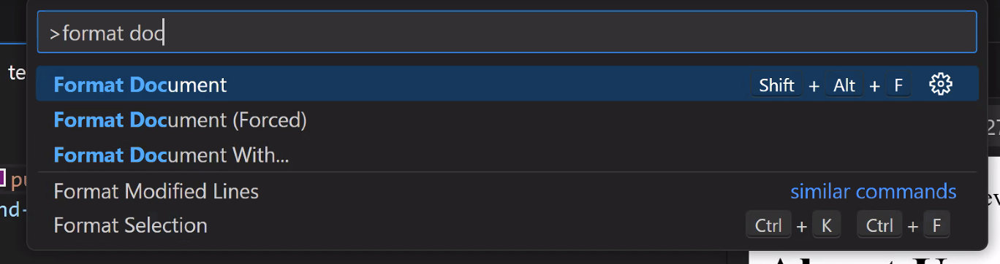
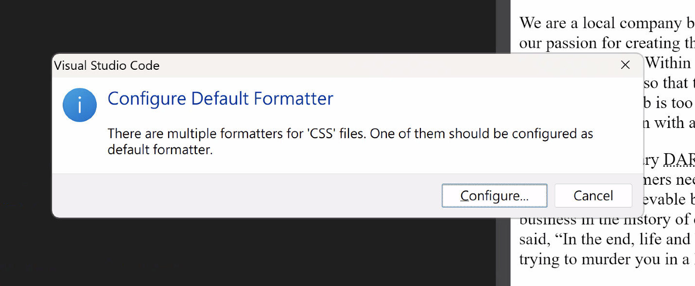
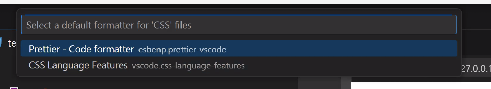
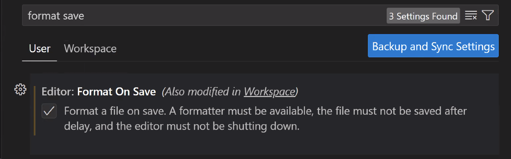

## How to setup Prettier

Ok so turns out setting up prettier is more complicated than I remember because I set up mine forever ago...

So! Step 1 is install the extension

Step 2 is have a document open you want to run prettier on (have an HTML file open in your editor)

Step 3 is either press `Shift + Alt/Opt + F` to run the `Format Document` command, or search for the command in the Command Palette. 

Step 3a you will get a popup like this... click "Configure"

Step 3b click on prettier or use the arrow keys to select it and press enter

Now prettier will run on the page and make everything look nice.

Bonus Step: If you want prettier to run automatically every time you save the page... You will need to go into your VS Code settings and search for "format save" then check the `Editor: Format On Save` checkbox.

