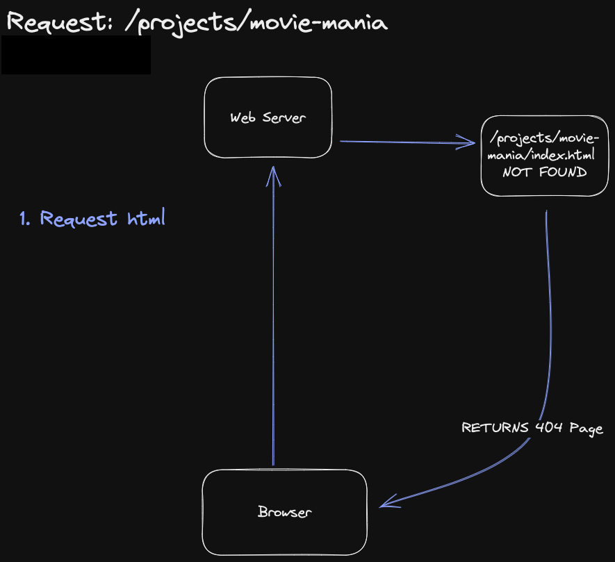

## Web Server's don't understand React Router

So, say you have a react SPA (Single Page Application) that uses React Router. You have the following routes:


1. `/`
2. `/projects`
3. `/projects/:id`
4. `/about`
5. `/contact`

Everything seems to be working in development, so you build and upload it to your FTP site. It is working fine there too, except for the routes. You can access the home page, but when your browser is already on a route and you do a full refresh, you get a 404 error.

## What's going on?

So, here is what happens when things are **working** (When you do a hard refresh or access your home page for the first time):


So far, so good. But when you are on a route and you do a hard refresh, this is what happens:



So the server is looking for a folder called 'projects' in your server, which doesn't exist. Because the server doesn't understand that the routing is meant to be handled by **JavaScript in your React application.**

## How to fix it?

### Step 1: Create a .htaccess file

Create a file called `.htaccess` in the `/public` folder of your project. What we need it to do is give special instructions to our server on how to handle requests.

### Step 2: Add the following code to your .htaccess file

```sh
Options -MultiViews
# We disable MultiViews
RewriteEngine On
# Then we turn on the RewriteEngine, allowing us to modify URLs based on certain conditions
RewriteCond %{REQUEST_FILENAME} !-f
# The !-f condition tells the server to only apply the following rule if the requested file does not exist
RewriteRule ^ index.html [QSA,L]
# The ^ index.html tells the server to redirect all requests to index.html
# The last array of letters mean the following:
# QSA: Query String Append - append the query string from the original request to the new URL
# L: Last - stop processing rules after this one
```

Here's what will happen once the htaccess is in place:


