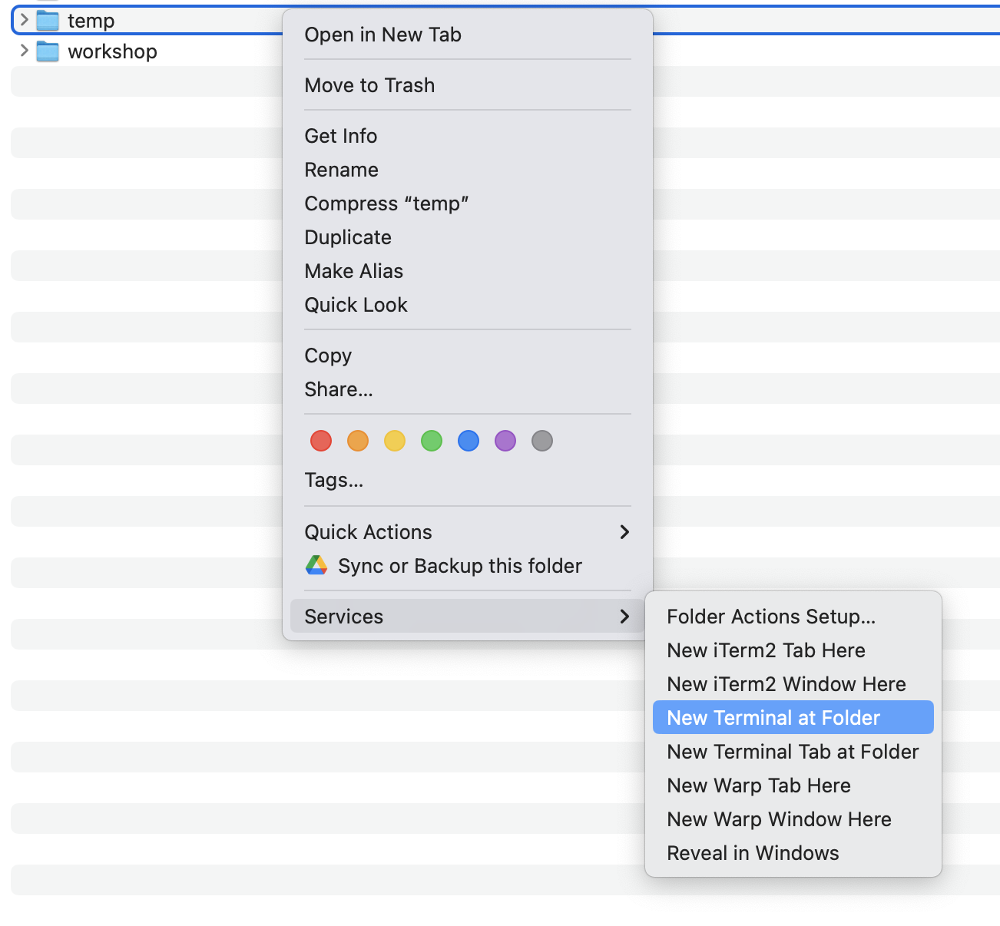
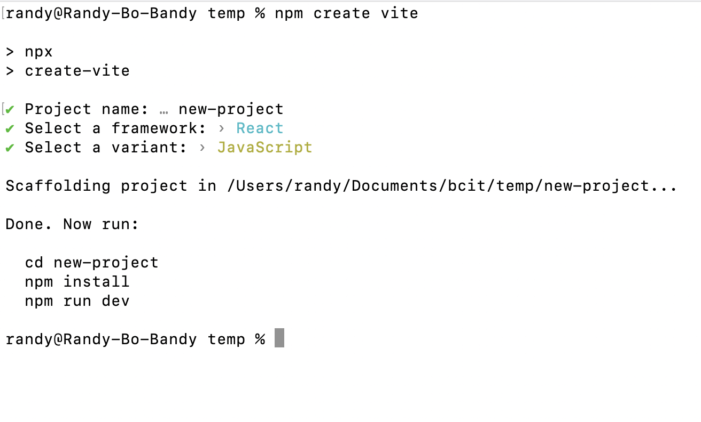
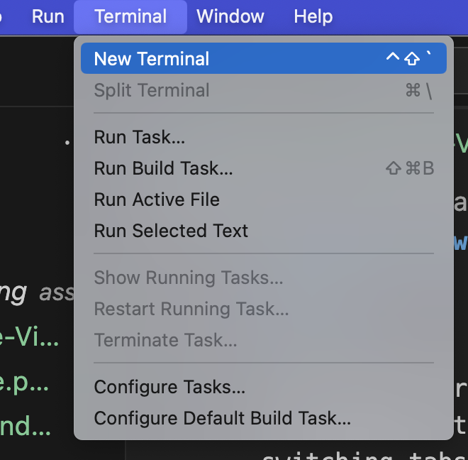
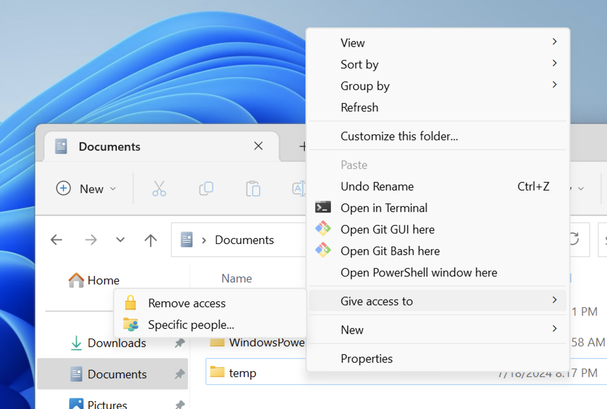
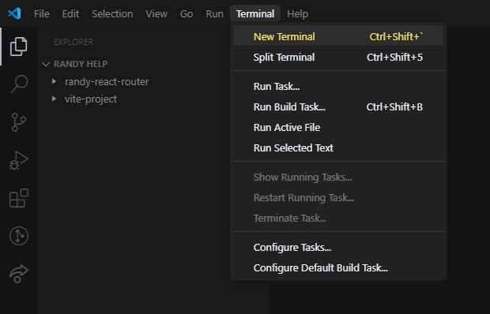
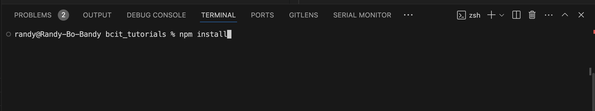

# Making a new Vite project from scratch

## Mac 

You should for the most part, be using the "integrated" terminal inside of VS code, no sense switching tabs when your code editor has a build in terminal. The main reason why you will ever need to open an independent terminal, is when you are creating a project from scratch.

Steps:
1. Open the parent folder, of where you intend to put your new project. Right click on that folder, then go to "services" and select "New Terminal at Folder"

2. Then you can run `npm create vite` and go through the steps to setup your new project.

3. From here, you can **close** the terminal! Even though it says to `cd blahblahblah` don't. Just close it. Now open that folder you created in VS Code. 

4. From within VS code, click "Terminal", then "New Terminal" 

5. Then you can run `npm install` and `npm run dev`

### Why? 

This allows you to skip the majority of folder navigation, etc. Using this strategy your terminal will always have a correct "working directory" - aka the commands you run will be running in the right place, as opposed to accidentally installing packages in the parent directory, etc.

## Windows

Steps:

1. Open the parent folder, of where you intend to put your new project. **HOLD** Shift & Right click on that folder, then go to "services" and select "Open PowerShell window here"

2. Then you can run `npm create vite` and go through the steps to setup your new project.

3. From here, you can **close** the terminal! Even though it says to `cd blahblahblah` don't. Just close it. Now open that folder you created in VS Code. 

4. From within VS code, click "Terminal", then "New Terminal" (I ran out of windows screenshots sorry)

5. Then you can run `npm install` and `npm run dev`

