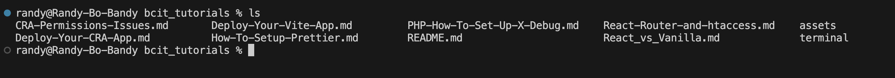
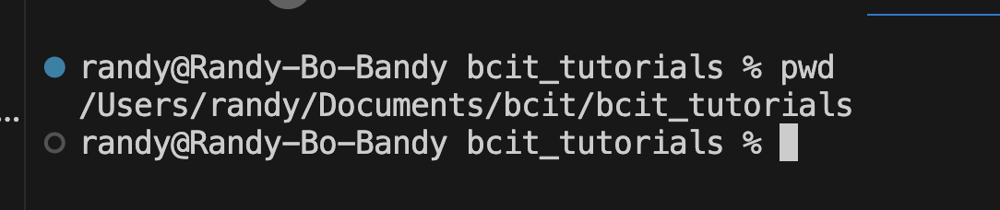

For both Mac Terminal and Windows Powershell, for people who have never used the terminal before, there are three commands that I recommend you start with:

1. ls (list files)
2. cd (change directory)
3. pwd (print working directory)****

These commands have the same syntax in both operations systems which is handy. 

`ls` will output all the folders/files in your terminals current "working directory".

A "Working Directory" is the location your terminal is currently pointing at. To better see this, you can type `pwd` to print the full path of where you terminal is currently located. 

Using `ls` can help you stay oriented and figure out where you want to go next. The `cd` command allows you to change directories. Thankfully, the knowledge you've gained about absolute paths and relative paths are 100% transferable to your skills here on the terminal. 

So if you want to go up to the parent directory of wherever you are. You would type `cd ..` to go back one directory. You can path into multiple folders at a time if you want. 

Knowing the location of your terminal is very important, as it can help you avoid common pitfalls like accidentally installing a git repo in your C: drive, or setting up projects / installing packages where you aren't intending to. 

This is why using the integrated terminal, as I recommended [here](./Crash-Course-Make-Vite-Project.md) from VS Code helps, as it automatically opens the folder from your workspace as the "working directory" making `cd` commands unnecessary.